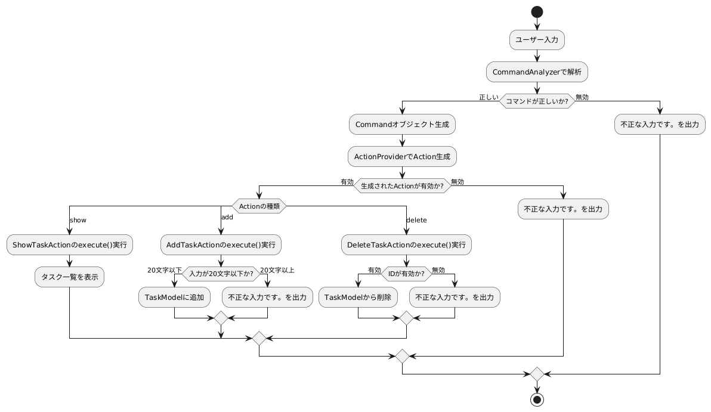

# アプリの概要

## 目的
ユーザーがタスクを簡単に管理できるようにすることを目的としています。タスクの追加、表示、削除ができるシンプルなインターフェースを提供します。

## 主要機能
- **タスクの表示**:
  `show`コマンドを入力することで、現在登録されているタスクを一覧表示します。タスクはIDとその内容が表示されます。

- **タスクの追加**:
  `add <タスク内容>`コマンドを使用して、新しいタスクを追加できます。タスク内容は20文字以内でなければならず、長すぎる場合にはエラーメッセージが表示されます。

- **タスクの削除**:
  `delete <タスクID>`コマンドを使用して、特定のタスクを削除できます。無効なIDが指定された場合にはエラーメッセージが表示されます。

## ユーザーインターフェース
ユーザーはコンソールにコマンドを入力することでアプリと対話します。入力が正しい場合は対応する処理が実行され、エラーが発生した場合には適切なエラーメッセージが表示されます。

## クラス構成
- **Command**: コマンド名と引数を保持するクラス。
- **CommandAnalyzer**: 入力されたテキストを解析し、`Command`オブジェクトを生成するクラス。
- **Actionインターフェース**: タスクの実行に必要な`execute`メソッドを定義するインターフェース。
- **ActionProvider**: コマンド名に基づいて適切なアクションを生成するクラス。
- **AddTaskAction, ShowTaskAction, DeleteTaskAction**: 各アクションの具体的な実装クラス。
- **TaskModel**: タスクのリストを管理し、タスクの追加や削除を行うクラス。
- **Task**: 各タスクのIDと内容を持つクラス。

## クラス図

## 各クラスの説明

### 3.1 Action インターフェース
タスク実行クラスで実装されるインターフェース。各操作に対する `execute()` メソッドを定義。

### 3.2 ActionProvider クラス
`Command` オブジェクトのコマンド名に応じて、対応する `Action` クラスのインスタンスを生成。
- `createAction(TaskModel, Command)`: コマンドに基づき、`ShowTaskAction`, `AddTaskAction`, `DeleteTaskAction` のいずれかを返す。

### 3.3 AddTaskAction クラス
`Action` を実装し、新しいタスクを追加する処理を行う。
- `execute()`: コマンド引数として渡されたタスク内容を追加。内容が20文字以上の場合はエラーを出力。

### 3.4 DeleteTaskAction クラス
`Action` を実装し、タスクの削除処理を行う。
- `execute()`: コマンド引数を数値に変換し、該当タスクを削除。数値変換に失敗した場合はエラーを出力。

### 3.5 ShowTaskAction クラス
`Action` を実装し、すべてのタスクを表示する。
- `execute()`: 登録されたタスクを表示。

### 3.6 TaskModel クラス
タスク管理クラス。タスクの追加、削除、一覧表示機能を提供。

### 3.7 Command クラス
ユーザー入力のコマンドと引数を保持。
- `getName()`, `getArg()`: コマンド名と引数を取得するメソッド。

### 3.8 CommandAnalyzer クラス
ユーザー入力を `Command` オブジェクトに変換。

### 3.9 Task クラス
タスクを表現するクラス。`id` と `text` を持つ。

## フロー図

## 各処理の詳細
### ユーザー入力
ユーザーがコンソールでタスク操作のコマンド（例: add, delete, show）を入力します。

### CommandAnalyzerによるコマンド解析
`CommandAnalyzer` はユーザーの入力をスペースで分割し、コマンド名と引数部分を抽出します。その後、コマンド名と引数を持つ `Command` オブジェクトを生成します。

### ActionProviderによるActionインスタンスの生成
`Command` オブジェクトに格納されたコマンド名をもとに、`ActionProvider` が対応する `Action` インスタンスを生成します。
- `show` コマンドの場合は `ShowTaskAction` インスタンスを返します。
- `add` コマンドの場合は `AddTaskAction` インスタンスを返します。
- `delete` コマンドの場合は `DeleteTaskAction` インスタンスを返します。
- それ以外の無効なコマンドでは、null を返し、エラーが出力されます。

### Actionのexecuteメソッドの実行
作成された `Action` インスタンスの `execute()` メソッドを呼び出し、指定されたアクションを実行します。

- **ShowTaskActionの場合（タスクの表示）**:
  `TaskModel` に格納されている全タスクの一覧を取得し、各タスクをコンソールに出力します。

- **AddTaskActionの場合（タスクの追加）**:
  コマンドの引数として渡されたタスクの文字数を検証します。20文字以内であれば、`TaskModel` に新しいタスクとして追加し、タスクIDを自動で割り当てます。21文字以上の場合は「不正な入力です。」とエラーメッセージを出力します。

- **DeleteTaskActionの場合（タスクの削除）**:
  コマンドの引数を数値に変換し、指定されたIDを持つタスクが存在するか確認します。該当するタスクがあれば `TaskModel` から削除し、該当しない場合は「不正な入力です。」とエラーメッセージを出力します。

## メソッド定義

### Actionインターフェース
- **メソッド名**: `execute`
  - **説明**: アクションの実行。
  - **戻り値**: void

### ActionProviderクラス
- **メソッド名**: `createAction`
  - **説明**: コマンド名に基づき、対応する `Action` オブジェクトを生成する。
  - **引数**:
    - `TaskModel model` - タスクモデル
    - `Command command` - コマンドオブジェクト
  - **戻り値**: `Action` - 生成された `Action` オブジェクト、または無効なコマンドの場合はnull

### AddTaskActionクラス
- **コンストラクタ**: `AddTaskAction`
  - **説明**: `AddTaskAction` オブジェクトの生成。
  - **引数**:
    - `TaskModel model` - タスクモデル
    - `String task` - タスク内容
- **メソッド名**: `execute`
  - **説明**: タスクを追加する処理を実行する。
  - **戻り値**: void

### DeleteTaskActionクラス
- **コンストラクタ**: `DeleteTaskAction`
  - **説明**: `DeleteTaskAction` オブジェクトの生成。
  - **引数**:
    - `TaskModel model` - タスクモデル
    - `int taskId` - タスクID
- **メソッド名**: `execute`
  - **説明**: タスクを削除する処理を実行する。
  - **戻り値**: void

### ShowTaskActionクラス
- **コンストラクタ**: `ShowTaskAction`
  - **説明**: `ShowTaskAction` オブジェクトの生成。
  - **引数**:
    - `TaskModel model` - タスクモデル
- **メソッド名**: `execute`
  - **説明**: タスクを表示する処理を実行する。
  - **戻り値**: void

### TaskModelクラス
- **メソッド名**: `addTask`
  - **説明**: タスクを追加する。
  - **引数**: `Task task` - 追加するタスク
  - **戻り値**: void
- **メソッド名**: `deleteTask`
  - **説明**: タスクを削除する。
  - **引数**: `int taskId` - 削除するタスクのID
  - **戻り値**: void
- **メソッド名**: `showTasks`
  - **説明**: タスクを表示する。
  - **戻り値**: void

### Taskクラス
- **コンストラクタ**: `Task`
  - **説明**: `Task` オブジェクトの生成。
  - **引数**:
    - `int id` - タスクID
    - `String text` - タスク内容

